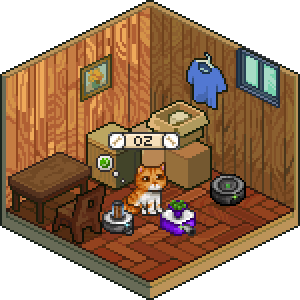

<h1 align="left">Hi , I'm <a href="https://github.com/Aguinaldofs"> Aguinaldo Feliciano de Souza</a></h1>  
         
[](https://www.linkedin.com/in/aguinaldo-fs)
[](mailto:aguinaldojunior@gec.inatel.br)

<p align="right">
 
</p>

```Python
 class about_me:
   name: "AG"
   nickname: "Aguinaldo Feliciano"
   summary: computer engineering student at Inatel, game developer
   and artist at free times
   age: 24
   passion: "Art, games, codes and pizza"
```
         

## Languages & Tools & Music

<p align="right">
 
</p>

```Python
 class tech_info:
   languages: ["Python", "JavaScript", "Java", "C#"]
   tools: ["Git", "VS Code", "Unity"]
```

## My summary

<p>
 ㅤㅤ
 
</p>
 
</p>

## Snake Commit Game


